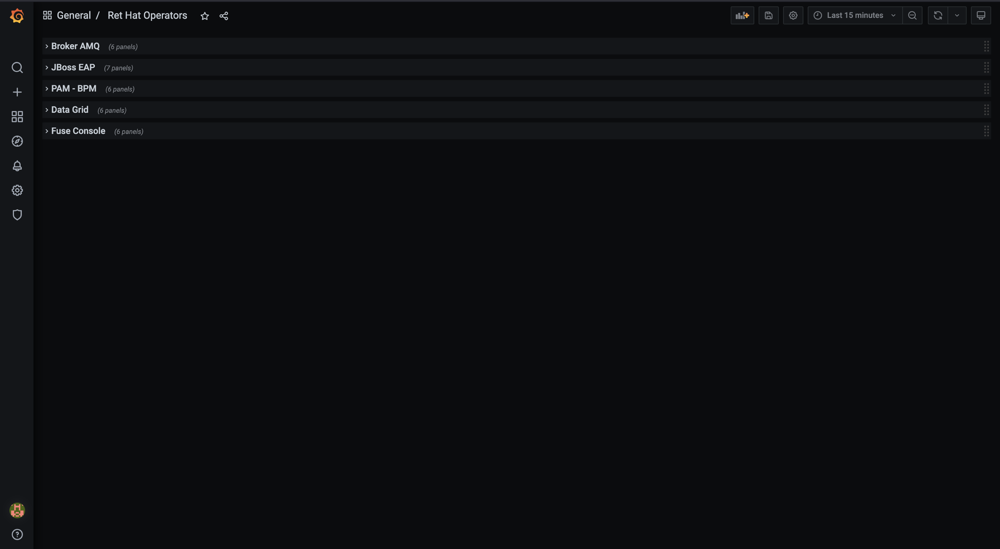

# OpenShift/Kubernetes Operators Scripts

Examples of how to run the scripts. They make certain assumptions; I suggest you read the scripts to understand them, ensure they are met when installing the Operator. Helm is one recommended approach to packaging Operators and their custom resources (CRs) templates.

## Sample CI/CD [Jenkins](Jenkinsfile) Job

```
pipeline {
    agent {
        node {
            label 'agent-node'
        }
    }

    parameters {
        string(name: 'OCPCredentialsId', defaultValue: 'ocp-sa-token', description: 'Token used by the OpenShift CLI to authenticate.', trim: true)
        choice(name: 'Action', choices: ['PATCH_CR', 'INSTALL_OPERATOR', 'UNINSTALL_OPERATOR', 'APPROVE_INSTALLPLAN', 'ALL'], description: 'List of actions to take. \nPATCH_CR: Choose this option for simply patching the Operator custom resources.\nINSTALL_OPERATOR: Choose this option for first time installation.\nUNINSTALL_OPERATOR: Choose this option for removing the operator and all its child resources; you need cluster-admin to delete the CRDs.\nAPPROVE_INSTALLPLAN: Choose this option to approve an InstallPlan; ensure the installPlan exist in the cluster prior.\n"ALL": Chose this option to execute all the stages in the Pipeline.')
        string(name: 'TargetNamespace', defaultValue: 'my-namespace', description: 'The target namespace to deploy the monitoring resources.', trim: true)
        string(name: 'OperatorName', defaultValue: 'amq-broker-rhel8', description: 'The operator name according to docs.', trim: true)
        string(name: 'StartingCSV', defaultValue: 'amq-broker-operator.v7.10', description: 'The operator version or startingCSV.', trim: true)
        string(name: 'OperatorChartName', defaultValue: 'amq7-operator', description: 'The chart name of the Operator.', trim: true)
        string(name: 'CRsChartName', defaultValue: 'amq7-broker', description: 'The chart name of the Sync resources.', trim: true)
        string(name: 'OperatorValuesFile', defaultValue: 'operator-resources/values.yaml', description: 'The vavlues file to use. Specify values in a YAML file or a URL (can specify multiple)', trim: true)
        string(name: 'CRsValuesFile', defaultValue: 'custom-resources/values.yaml', description: 'The vavlues file to use. Specify values in a YAML file or a URL (can specify multiple)', trim: true)
    }

    options {
        timeout(time: 30, unit: 'MINUTES') 
        timestamps()
        buildDiscarder(logRotator(numToKeepStr: '20', daysToKeepStr: '30'))
        disableConcurrentBuilds()
        disableResume()
    }

    [....]
    
}
```

Follow [this link](./Jenkinsfile) to view the complete `Jenkinsfile`.

## [Approve](manual-approve.sh) Operator InstallPlan

```sh
# Set Environment Variables
NAMESPACE=my-namespace
OPERATOR_NAME=amq-operator-rhel8

# Run Script
sh manual-approve.sh $NAMESPACE $OPERATOR_NAME
```

## [Cleanup](cleanup.sh) Operator

```sh
# Set Environment Variables
NAMESPACE=my-namespace
OPERATOR_NAME=amq-operator-rhel8
STARTING_CSV=amq-broker-operator.v7.10
CHART_NAMES="amq-operator,amq-broker"

# Run Script
sh cleanup.sh $NAMESPACE $OPERATOR_NAME $STARTING_CSV "$CHART_NAMES"
```

## [Red Hat Operators Grafana Dashboard](./grafana-dashboard-rh-operators-pod-resources.json)

Currently the dashboard looks for pods with following tags:

- AMQ Operator: `rht.subcomp=broker-amq`

- JBoss EAP Operator: `rht.comp=EAP`

- PAM/BPM Operator: `rht.comp=PAM`

- Data Grid Operator: `com.redhat.component.name=Data_Grid`

- Fuse Console Operator: `rht.comp="fuse console"`

Usually Operators come with default tags. However, Red Hat products deployed as templates objects may require tags be added manually. 

For example, apps deployed with JBoss EAP 7.x as base image will not have these tags by default but we can add the `rht.comp=EAP` tag for the dashboard to discover them. to You can fetch pod tags with this prometheus query `kube_pod_labels{namespace=~"my-namespace"}`.



The Helm chart used for the deployment of the the datasources and dashboard is available [here](./rht-middleware-monitoring/).


To monitor more Operators not already on this dashboard, follow these steps:

1. Ensure target pods have the necessary tags, add them if missing.
   
   In the prometheus query results, tags are displayed a  bit differently with `label_` prepended, dots (`.`) and hyphens (`-`) replaced by underscore (`_`).
2. Duplicate the Grafana Panels and Rows as needed
3. Refine the `kube_pod_labels{namespace=~"my-namespace"}` query until satisfied with output. Loot at the dashboard for an example.
4. Save your changes


